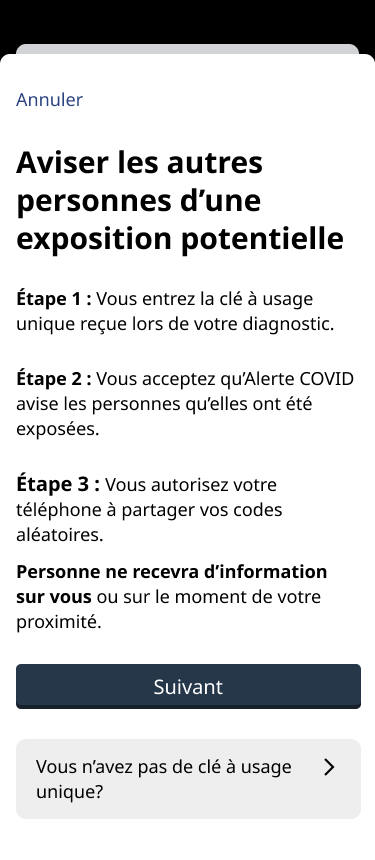
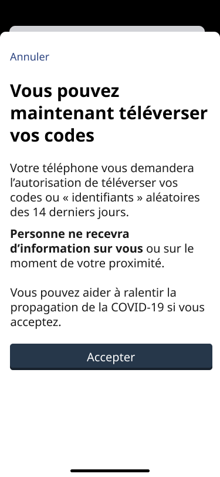
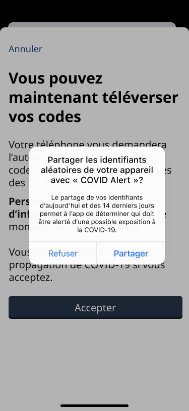
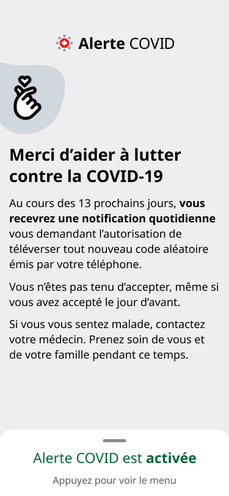
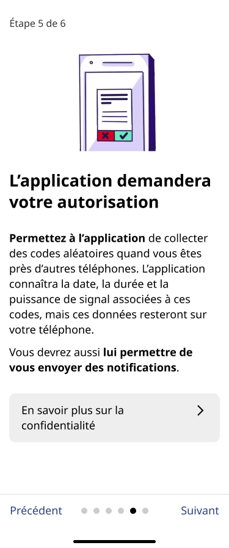
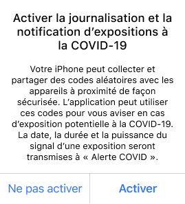
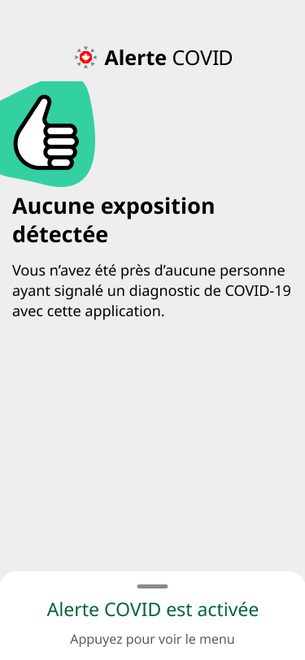
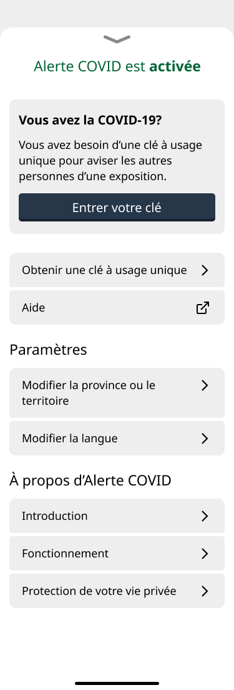

[English](https://github.com/cds-snc/covid-alert-documentation/blob/main/research/UsabilityAug2020.md)

# Dans quelle mesure l’application aide-t-elle les utilisateurs quand ils reçoivent un résultat positif (et une clé à usage unique) 

Date : 25 août 2020 \
Auteures : Jeana Frost et Adrianne Lee \
Traduit par : Élise Cossette

## Participants et contexte

Neuf personnes ont participé à une activité de recherche sur la remise de la clé à usage unique pour Alerte COVID : 5 anglophones et 4 francophones. Les tests ont eu lieu pendant la semaine du 14 août 2020. La plupart des participants faisaient partie des premiers à adopter la technologie et suivaient de près les nouvelles et les efforts en lien avec l’application mobile. Ils avaient déjà installé l’application sur leur téléphone. L’un d’eux avait été bêta-testeur, et certains ont téléchargé l’application dès qu’elle est sortie. Pour les besoins de cette recherche, les participants ont utilisé un prototype Figma qui imite une partie, mais pas la totalité, de l’interactivité de l’application réelle.

 

Pour les besoins de la recherche, une employée du SNC a joué le rôle d’une infirmière de la santé publique qui fournit une clé à usage unique.

 

## Principaux résultats de recherche pour l’application :

*   Les participants ont apprécié les explications, mais ont trouvé qu’il y avait beaucoup d’étapes de consentement. Les écrans « Aviser les autres personnes d’une exposition potentielle », « Vous pouvez maintenant téléverser vos codes » et la fenêtre surgissante « Partager les identifiants aléatoires » semblaient redondants pour les participants.

    

   

    

*   Il y a eu confusion entre « clé » et « codes » : (reformulation) « J’ai entré un seul code, pourquoi ça me demande d’envoyer tous mes codes? »
*   « La phrase ”Vous pouvez maintenant téléverser vos codes” suggère une participation de ma part. » Cette phrase donnait l’impression au participant qu’il pouvait téléverser les codes manuellement, un par un.
*   À l’écran de remerciement, il y a eu une certaine inquiétude et une certaine confusion quant à la raison pour laquelle les participants doivent confirmer le partage des codes. Ils ont demandé s’il était possible de confirmer tous les partages d’un seul coup.

    

*   Un sentiment de panique pendant l’appel peut mener à la nécessité de faire un suivi.

## Quels types de questions les participants ont-ils eus par rapport aux écrans d’introduction de l’application?

*   Les personnes ont passé à travers les pages d’introduction assez rapidement. Pour la plupart, c’est parce qu’elles les avaient déjà lues auparavant. L’une d’entre elles a mentionné qu’elle ne lisait pas les pages ayant beaucoup de texte.
*   À l’étape 5 (« L’application demandera votre autorisation »), comprendre le concept de « code » a ralenti les participants.

   

*   Pour un participant, ce n’était pas clair si le Bluetooth devait être activé pour que l’application fonctionne.
*   Deux personnes francophones ont eu de la difficulté à comprendre le mot « aléatoire ». L’une d’elle parlait le français comme langue seconde. 
*   Deux personnes ont commenté le contenu de la fenêtre surgissante « Activer la journalisation ». Elles trouvaient que la taille du texte était petite et que le texte était long.

    

 

## Quelles étaient les difficultés liées à la saisie de la clé à usage unique dans l’application?

### À propos de l’interface

La plupart des personnes ont dit que l’interface était claire et que l’interaction était simple. Il y a toutefois quelques points à améliorer.

 

*   Pour une personne, il n’était pas évident que l’onglet « Appuyez pour voir le menu » était l’endroit permettant d’entrer le code. Le menu « contient beaucoup de choses », et le mot « clé » revient souvent. Une personne a avancé qu’elle pourrait cliquer sur « Obtenir une clé à usage unique » au lieu de « Entrer votre clé ».

    

    

*   Quelques participants ont demandé à la personne jouant le rôle d’infirmière s’ils devaient saisir leur clé en lettres majuscules ou minuscules. L’« infirmière » leur a répondu que les deux options fonctionnaient. Cette question a aussi été posée par les unités de santé publique pendant l’introduction provinciale au portail.
*   Les participants ont apprécié les explications, mais ont trouvé qu’il y avait beaucoup d’étapes de consentement. Les écrans « Aviser les autres personnes d’une exposition potentielle », « Vous pouvez maintenant téléverser vos codes » et l’invite « Partager les identifiants aléatoires » semblaient redondants pour les participants.
*   Il y a eu confusion entre « clé » et « codes » : (reformulation) « J’ai entré un seul code, pourquoi ça me demande d’envoyer tous mes codes? »
*   « La phrase “Vous pouvez maintenant téléverser vos codes” suggère une participation de ma part. » Cette phrase donnait l’impression au participant qu’il pouvait téléverser les codes manuellement, un par un.
*   Une personne a fait remarquer que « téléverser les codes » est facile à confondre avec « envoyer la clé à usage unique ».
*   Les captures d’écran consultées par l’« infirmière » ne correspondaient pas exactement à ce que voyaient les participants dans le prototype, ce qui a un peu mêlé ces derniers.
*   Une personne a mentionné qu’il pouvait être difficile pour d’autres personnes d’alterner entre la fonction téléphone de leur appareil (pour parler à l’infirmière) et l’application Alerte COVID (pour saisir leur clé), et qu’elles pourraient avoir besoin d’instructions supplémentaires.
*   Les personnes ont compris l’alphabet radio. L’une d’entre elles était surprise de constater que ce n’était pas l’alphabet radio communément utilisé, bien qu’elle ait compris le nouveau système.

 

Limite de la recherche : la plupart des personnes ont écouté les instructions sans lire tout le contenu. Il est donc difficile de savoir si elles éprouveraient des problèmes ou non si jamais elles étaient seules.

### Aspect émotif

*   Quelques personnes ont cru qu’elles seraient prises de panique lors d’un tel appel, et que de telles émotions les empêcheraient de suivre les instructions et de traiter les informations reçues.
    *   L’un des participants a évoqué une expérience antérieure, où il avait reçu un diagnostic pour une autre maladie, ainsi que le stress que cela lui avait causé, même s’il s’agissait d’une maladie non transmissible.
*   L’une des personnes s’est déjà fait tester pour la COVID et a dit qu’il s’agissait d’une expérience stressante, et qu’elle ne serait pas en mesure de recevoir toutes les informations pendant un tel appel. Elle a demandé à ce que les instructions soient transmises par écrit lors d’un suivi.
*   Le script utilisé par l’« infirmière » pendant l’appel n’était pas le véritable script utilisé par les professionnels de la santé et était probablement bien plus court. Malgré cela, il semble que cela représentait beaucoup d’informations. L’une des participantes s’est inquiétée de la façon dont elle et les autres personnes pourraient se souvenir de toutes les informations communiquées durant l’appel.

 

### Aspect pratique

*   Certaines personnes disent généralement ne pas répondre au téléphone. Elles ont besoin de voir qui les appelle pour répondre. Elles ont craint que cela fasse en sorte qu’elles ratent l’appel.
*   Les personnes ont réagi de diverses façons lorsqu’elles parlaient à la personne qui jouait le rôle d’infirmière de la santé publique :
    *   Répondre au téléphone avec une main, prendre des notes avec l’autre main. Passer au mode haut-parleur pour pouvoir entrer la clé.
    *   Répondre au téléphone et le tenir avec l’épaule, prendre en note la clé. Passer au mode haut-parleur.
    *   Utiliser des écouteurs Bluetooth tout le long de l’appel (la personne les utilisait déjà pour la vidéoconférence).
    *   Utiliser le mode haut-parleur tout le long de l’appel (la personne répond ainsi à tous ses appels).
    *   Utiliser des écouteurs (ce n’est pas ce que la personne ferait normalement, mais elle avait préparé des écouteurs en prévision de l’appel).
*   Le fait de ne pas être capable d’entendre l’« infirmière » en même temps que d’entrer la clé à usage unique a semblé causer une certaine gêne. La plupart des personnes sont passées au mode haut-parleur quand l’« infirmière » leur a demandé si elles étaient prêtes à entrer la clé.
    *   C’était une bonne chose que l’« infirmière » demande aux participants s’il s’agissait d’un bon moment pour leur parler. Le mode haut-parleur pourrait représenter un enjeu pour la vie privée.
    *   Beaucoup se sont montrés attentifs à l’« infirmière » et ont essayé de toujours être en mesure de l’entendre et de lui parler.
*   Certaines personnes ont noté la clé par écrit et ont suggéré que l’infirmière les invite à prendre un papier et un crayon.
*   Quelques participants ont fait remarquer que les personnes risquent de ne lire que le titre des écrans, puisqu’elles sont au téléphone avec quelqu’un. L’une des participantes n’a pas lu les instructions à l’écran parce que l’« infirmière » les lui disait au téléphone. 
*   Certaines personnes ont spontanément répété la clé à l’« infirmière ». Pendant l’un des appels, la participante n’a pas été guidée jusqu’à l’écran final « Merci d’aider à lutter contre la COVID-19 ». 
*   Dans deux des séances, l’appel a coupé à quelques reprises. Les coupures ne se sont pas produites pendant la lecture de la clé, mais il s’agit d’un problème potentiel.

## Que suggèrent les participants pour mieux passer à travers les prochaines étapes?

*   Quelques personnes ont parlé de l’état émotif possible des personnes pendant l’appel et de la façon dont cela pouvait affecter l’échange téléphonique.
    *   Une personne ayant déjà passé le test pour la COVID ainsi qu’un autre participant ont suggéré de faire un suivi et d’envoyer les instructions par courriel ou message texte.
    *   Les participants aimeraient pouvoir rappeler quelqu’un pour obtenir des réponses à leurs questions après avoir eu le temps de réfléchir.
*   Trois personnes se sont montrées préoccupées par le fait d’avoir à confirmer le partage de codes quotidiennement pendant 13 jours. 
    *   Les participants croient que les personnes vont perdre intérêt à le faire et oublier de le faire chaque jour, ce qui causerait une perte de données. Certains ont demandé la possibilité d’autoriser d’un seul coup le partage pendant 13 jours. Cette préoccupation peut être causée par le fait que l’interface n’explique pas clairement l’utilité de partager les codes pendant 13 jours au lieu d’accorder une autorisation générale. L’un des participants s’attendait (après avoir vu les pages introductives) à partager les codes pendant 13 jours d’un seul coup.
*   Besoin d’un rappel sur la façon dont les notifications fonctionnent.
    *   Les personnes ont fait remarquer qu’au moment où elles saisissent leur clé, cela peut faire des mois qu’elles ont téléchargé l’application et qu’elles sont passées à travers les pages introductives. Quand elles téléversent leurs codes, ce pourrait être une bonne occasion de leur rappeler les implications en matière de vie privée.
*   Il y a eu des questions au sujet des mesures à prendre en dehors de l’application.
    *   Les participants ont demandé s’ils devaient quand même avertir leur famille et leurs amis.

## Attentes non satisfaites vis-à-vis de l’application

*   Deux participants ont mentionné qu’ils s’attendaient à ce que l’application soit une application _spécifique_ à la COVID-19, et non juste une application permettant d’aviser les autres.
*   L’une d’elles s’attendait à voir une carte géographique montrant l’état de la situation à travers le pays et à recevoir des mises à jour sur la COVID-19. Cette demande a aussi été reçue pendant le test bêta.
*   L’autre participant s’attendait à pouvoir trouver des informations au sujet du diagnostic après avoir reçu son diagnostic, par exemple des conseils médicaux (notamment les informations fournies pendant le scénario de l’appel téléphonique) et les coordonnées de professionnels de la santé.
